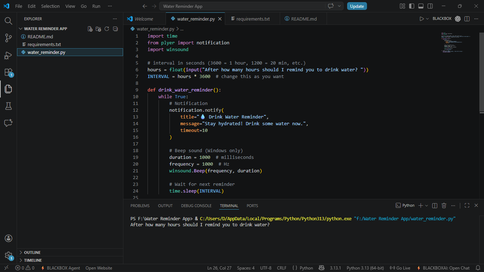
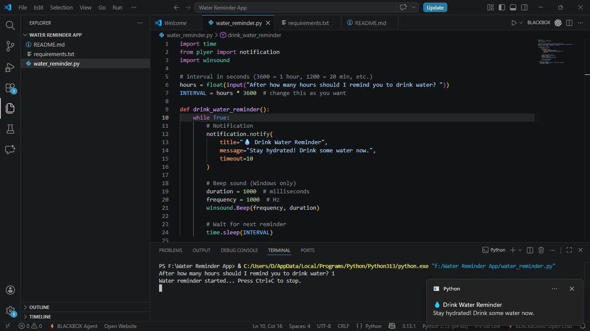

# 💧 Water Reminder Application

A simple Python application that reminds users to drink water at customizable intervals using desktop notifications and sound alerts.



---

## 📌 About the Project

Staying hydrated is important, but while studying, coding, or working for long hours, it is easy to forget to drink water regularly.

This Python-based application helps users maintain healthy hydration habits by sending desktop notifications along with a sound alert at user-defined intervals.

The project demonstrates the use of Python automation, notifications, user input handling, and scheduling concepts.

---

## ✨ Features

✅ Custom reminder interval

✅ Desktop notifications

✅ Sound alerts using Windows Beep

✅ Lightweight and easy to use

✅ Continuous background monitoring

✅ Beginner-friendly Python project

---

## 📸 Screenshots

### Application Preview


### Notification Popup



---

## 🛠 Technologies Used

- Python
- Plyer
- Winsound
- Time Module

---

## 📁 Project Structure

```text
Water Reminder App/
│
├── Screenshots/
│   ├── application-preview.png
│   └── notification-popup.jpg
│
├── water_reminder.py
├── requirements.txt
└── README.md
```

## ⚙️ Installation

### Clone the Repository

```bash
git clone https://github.com/khushirai2216-boop/Water-Reminder-App.git
```

### Move into the Project Folder

```bash
cd Water-Reminder-App
```

### Install Required Dependencies

```bash
pip install -r requirements.txt
```

---

## ▶️ Usage

Run the application:

```bash
python water_reminder.py
```

Enter the reminder interval in hours when prompted.

Example:

```text
After how many hours should I remind you to drink water? 1.5
```

The application will send a desktop notification every 1.5 hours.

---

## 🔔 Example Notification

Title:

💧 Drink Water Reminder

Message:

Stay hydrated! Drink some water now.

---

## 📚 What I Learned

- Working with Python libraries
- Desktop notification systems
- Time-based automation
- User input handling
- Project structuring for GitHub
- Writing documentation using Markdown

---

## 🚀 Future Improvements

- Graphical User Interface (GUI)
- Daily water intake tracking
- Reminder history
- Multiple reminder schedules
- Cross-platform notification support
- Dark mode interface

---

## 🤝 Contributing

Contributions, suggestions, and improvements are welcome.

Feel free to fork the repository and create a pull request.

---

## 📄 License

This project is open-source and available under the MIT License.

